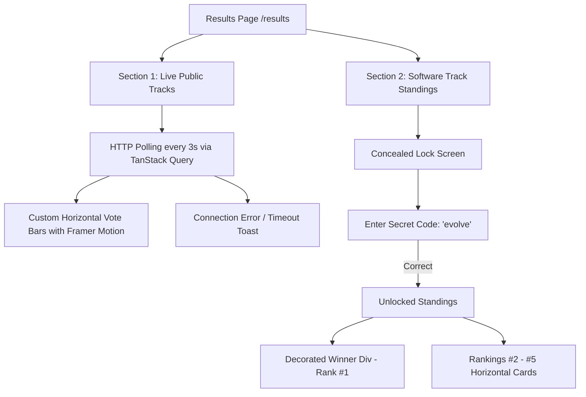

# Live Results & Software Track Standings Implementation Plan

This plan details the technical architecture for the **Live Results Page (Stage 8)**, replacing WebSockets/Django Channels with robust HTTP polling, custom Framer Motion horizontal bars, color-coded project cards, and a concealed Software Track reveal feature powered by the `"evolve"` unlock code.

---

## Technical Architecture & Workflow

---

## User Review Required

> [!IMPORTANT]
> **Secret Unlock Code:** The Software Track aggregate results will remain concealed behind a lock screen requiring the secret code **`evolve`**.
> **HTTP Polling Interval:** The live public tracks will poll `/api/results/live/` every 3 seconds to ensure smooth, responsive transitions without WebSockets.

---

## Proposed Changes

### 1. Backend (`core` & `judging` Apps)

#### [NEW] [backend/core/views.py](file:///home/azimeh/Desktop/Code/NACOS%20VOTING%20PORTAL/backend/core/views.py) / [backend/judging/views.py](file:///home/azimeh/Desktop/Code/NACOS%20VOTING%20PORTAL/backend/judging/views.py)
- Create `LiveResultsAPIView` (`GET /api/results/live/`):
  - Returns live vote counts, percentage distribution, and assigned color tokens for projects in public voting tracks (`graphic_design`, `ai_prompting`).
- Create `JudgedResultsAPIView` (`POST /api/results/judged/`):
  - Accepts `{ "code": "evolve" }`.
  - Computes aggregate judge scores across all criteria and judges for Software Track entries.
  - Sorts entries by total/average score.
  - Returns `{ "unlocked": true, "winner": {...}, "rankings": [...] }`.

#### [MODIFY] [backend/core/urls.py](file:///home/azimeh/Desktop/Code/NACOS%20VOTING%20PORTAL/backend/core/urls.py) / [backend/judging/urls.py](file:///home/azimeh/Desktop/Code/NACOS%20VOTING%20PORTAL/backend/judging/urls.py)
- Register `/api/results/live/` and `/api/results/judged/` routes.

---

### 2. Frontend (UI & State)

#### [NEW] [frontend/src/api/resultsAPI.ts](file:///home/azimeh/Desktop/Code/NACOS%20VOTING%20PORTAL/frontend/src/api/resultsAPI.ts)
- Add `fetchLiveResults()` for polling vote distributions.
- Add `unlockJudgedResults(code)` for unlocking Software Track standings with `"evolve"`.

#### [NEW] [frontend/src/pages/home/ResultsPage.tsx](file:///home/azimeh/Desktop/Code/NACOS%20VOTING%20PORTAL/frontend/src/pages/home/ResultsPage.tsx)
- Build the main Results view:
  1. **Header & Live Polling Indicator:** Shows pulse badge ("LIVE HTTP Stream") and refresh timer.
  2. **Public Tracks Section (Graphic Design & AI Prompting):**
     - Custom horizontal bar charts using Framer Motion `motion.div` with spring transitions.
     - Color-coded bar fills tied to unique project registration codes.
     - "In the Race" project grid cards detailing entries per category.
  3. **Software Track Section (Concealed / Locked View):**
     - Password input box for `"evolve"`.
     - Upon unlock:
       - Large, decorated **Winner (#1 Rank)** card featuring code, title, team name, and aggregate score.
       - Clean horizontal cards for ranks #2 through #5.

#### [NEW] [frontend/src/routes/results.tsx](file:///home/azimeh/Desktop/Code/NACOS%20VOTING%20PORTAL/frontend/src/routes/results.tsx)
- Route handler for `/results`.

#### [MODIFY] [frontend/src/components/home/SideNav.tsx](file:///home/azimeh/Desktop/Code/NACOS%20VOTING%20PORTAL/frontend/src/components/home/SideNav.tsx)
- Ensure link `/results` with label "Results" and Trophy icon is routed correctly.

---

## Verification Plan

### Automated Verification
- Run `npx tsc --noEmit` on frontend to verify TypeScript types and route mappings.
- Run `.venv/bin/python manage.py check` on backend to verify models and endpoints.

### Manual Verification
1. Open `/results` in browser.
2. Verify live HTTP polling updates vote counts every 3 seconds with smooth Framer Motion bar animations.
3. Simulate network loss or timeout to verify the toast notification triggers.
4. Locate the Software Track section, verify it is concealed.
5. Enter code `"evolve"` and verify the decorated Winner card and rankings #2 to #5 are revealed.
